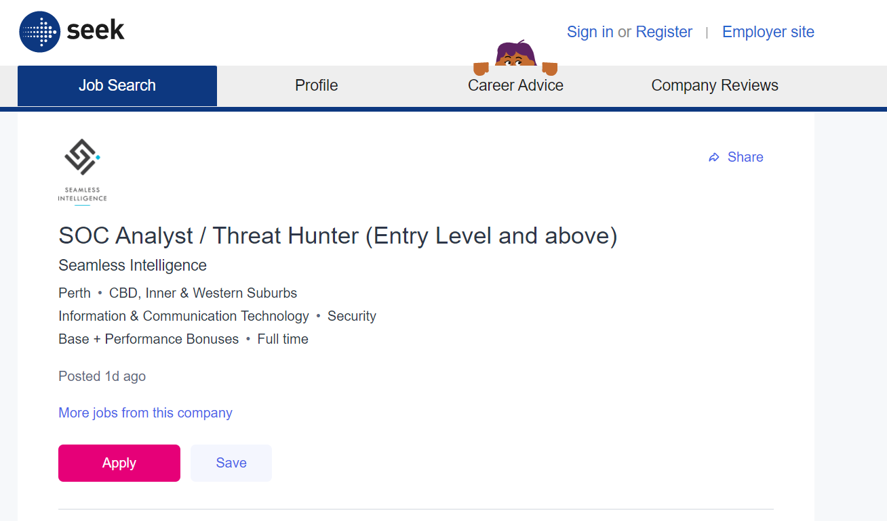
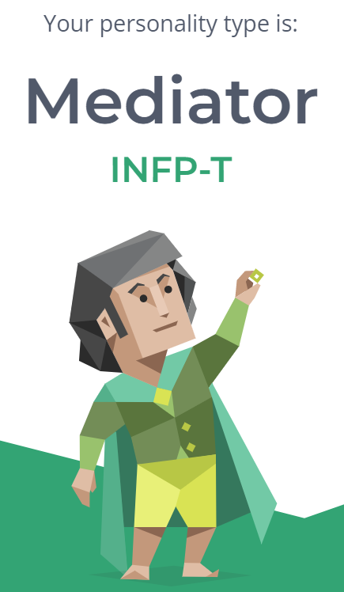

## Ayrtaan Sadirov

Student Number: S3943294 

Email: s3943294@student.rmit.edu.au 

<body>
  <div class="wrapper">
     
  </div>
</body>
 
My name is Ayrtaan Sadirov, I am an ethnic Uyghur and an Australian Citizen. I can speak English fluently and Uyghur semi-fluently and I enjoy playing basketball and some video games. 

You can use the [editor on GitHub](https://github.com/AyrtaanSadirov/studentprofile/edit/main/README.md) to maintain and preview the content for your website in Markdown files.

Whenever you commit to this repository, GitHub Pages will run [Jekyll](https://jekyllrb.com/) to rebuild the pages in your site, from the content in your Markdown files.

### Interest in I.T
My main interests in I.T would have to do with Cyber-security and Machine-learning. I am very interested in becoming a white-hat hacker, which is a hacker that is hired by companies to test their security by attempting to breach them. I’ve always had a vague interest in I.T, but they have recently become more specific and clear. 

My interest in I.T began with videogames, I loved playing them with my friends. I originally wanted to be a video game designer but then I grew past video games and moved on to other features of I.T. Videogames will always have a special place in my heart, even though I don’t play them nearly as much as I used to. 

I chose to come to RMIT embarrassingly enough because my girlfriend wanted to come here. I honestly never really cared for which university I went to. If the destination is the same, why should I care about how I got there?

I expect to learn not only to code but also how to interact and work with others in this field. I believe that being able to work with others will truly help someone succeed in any field of work.


Markdown is a lightweight and easy-to-use syntax for styling your writing. It includes conventions for

```markdown
Syntax highlighted code block

# Header 1
## Header 2
### Header 3

- Bulleted
- List

1. Numbered
2. List

**Bold** and _Italic_ and `Code` text

[Link](url) and 
```

For more details see [Basic writing and formatting syntax](https://docs.github.com/en/github/writing-on-github/getting-started-with-writing-and-formatting-on-github/basic-writing-and-formatting-syntax).

### Ideal Job

<body>
  <div class="wrapper">
     
  </div>
</body>
<a href="https://www.seek.com.au/job/56396015?type=promoted#sol=78fbdef32240eace6df6b12a04a927c4c72d196d">SOC Analyst / Threat Hunter (Entry Level and above)</a>

### Personal Profile

<body>
  <div class="wrapper">
     
  </div>
</body>

<body>
  <div class="wrapper">
     
  </div>
</body>

### Project Idea 
# Overview:
My project idea is essentially an app which utilizes tools from Google Maps and other applications like it to pick and choose places for you to eat at. It differs from other apps such as Uber Eats because it is not a delivery service, but a service to find good food, whether you're in a new part of town or if you just happen to be an indecisive person. I’ve thought of three potential names for this app, “Choosi”, “Yumi”, or “Pick This For Me.”

# Motivation:
Have you ever gone out with your friends, colleagues or partner, and then get stumped on where to eat? My motivation stems from the annoying indecisiveness I observe in myself and my friends whenever we go out. Either we never unanimously agree on a restaurant, or one of us can think of a good place ourselves. This is where I got the idea to include a third-party to make the choice for us. The goal with I.T is to use technology to make lives easier, and with this app, it will make choices easier for us too. Granted, this problem is a very superficial one, however, it doesn't mean it shouldn't be solved.

# Description: 
On the very first start up of the app, the user creates an account which the app uses to keep logs on their various likes and dislikes in foods and restaurants. After gathering basic details, like their name and phone number, the user will be prompted to enter in their favorite foods and what restaurants they most enjoy eating at (they can enter as many or as little as they want). After this step, the account creation stage is finished. The user now has access to the app and will be asked to be able to use their location for more accurate results and for restaurants that are closer. If the user does not want to disclose their location, the restaurants the app chooses may be out of reach for them, and they will be reminded of this after making that decision. Choices are based on the user’s preferences, however restaurants can also be randomized if the user wishes. The app will utilize Google Maps for navigation and restaurant finding, and the choice of restaurant is made by the app with as much information it has on the user. This process is started when the user navigates the user inference, which will include, “Account Settings”, “Find a Restaurant”, “Edit My Location” and “I’m Feeling Lucky”. The “I’m Feeling Lucky” option will randomly recommend the user any restaurant loosely within a 10 km radius (the range can be increased in “Account Settings”). The “Find a Restaurant” option will use the information to find the best possible restaurant for the user to eat at. Users will also have the option to add preferences that will be used in isolation from their base preferences for this instance. This is to cater towards groups of people who may have different tastes from one another. The app will collect all the restaurants surrounding the users and rank them from what it thinks the user would enjoy the most to what it thinks the user would enjoy the least. This is done so that if the user doesn't like the first option, they can move onto the next, and so on and so forth. Once the user makes a choice, the app will enter navigation mode,  utilizing Google Maps to navigate the user to their desired restaurant. When the user reaches the restaurant the app exits navigation mode, wishing the user to have a good meal. When the app notices the user leaving the restaurant, it will send a notification to their phone, surveying them on how they enjoyed the food. It will simply be a ranking out of ten. If the user doesn’t open the notification, the app would simply ask them again the very next time they open the app. If the user chooses to complete the survey, the app will store this information and use it in the future. The app will become more accurate the more information the user provides. For more casual and secretive users, the app will try to get them to turn on their locations or tell them their favorite restaurants by sending them a notification every once in  a while, telling them that their experience with the app will become enhanced if they do. I will be careful not to over-step the legal boundaries regarding information and will hold a very high ethical standard with this app. I will take great care in ensuring that the process is as quick and easy as possible by having an easy to manage U.I.

# Tools and Technologies:
Google Maps cannot be built into the app due to legal restrictions. Uber paid Google Maps about 58 million to use their services on their app, and I obviously don’t have the money for that. However, perhaps the app can work separately with Maps by sending it information. Therefore, Google Maps will have to be downloaded on the user phone in order for it to work. I will also need an app making program such as Microsoft Power Apps or Quixy in order to actually build my app. For hardware, my laptop will be used to build the app and my phone will be used to test it.

# Skills Required:
I will need experience with coding languages that build apps such as Java and Python. I will also need to develop marketing skills, like knowing where to place advertisements or paying people to promote my app,  for the app to grow.  I need to familiarize myself with copyright laws and other legal focuses to protect myself and my app, just in case anyone tries to take my idea for their own.

# Outcome:
If the project is successful, then making the choice of where to eat out will become much easier for my users. With the app’s search features, restaurants will be found that fit the users taste and they’ll be navigated towards it. If the app becomes big enough, then I’ll look to add delivery services as well to make the user experience more easier. It will differ from apps such as Uber Eats for its restaurant suggestion capabilities.


Having trouble with Pages? Check out our [documentation](https://docs.github.com/categories/github-pages-basics/) or [contact support](https://support.github.com/contact) and we’ll help you sort it out.
